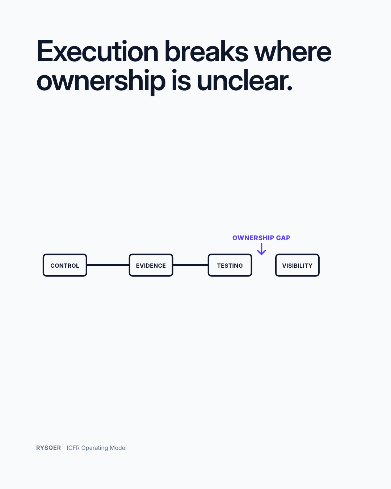
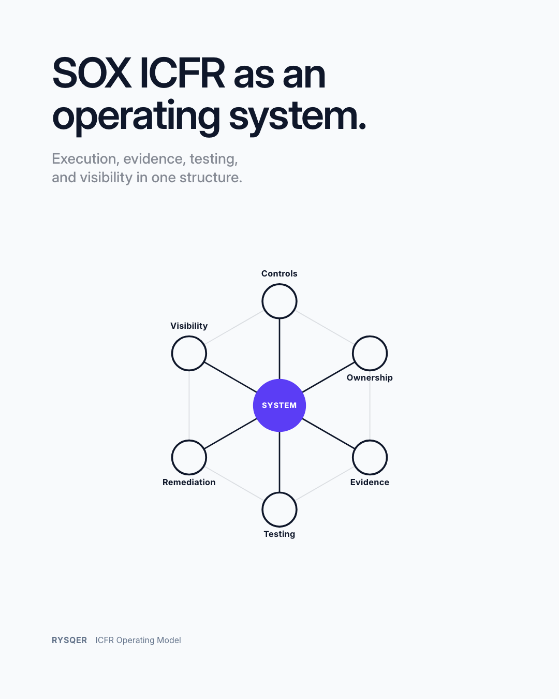

# Rysqer — ICFR Operating Model

Rysqer is an ICFR operating model for SOX execution.

ICFR does not fail in design.
It fails in execution.

Controls are documented.  
Ownership is assigned.  
Testing exists.

On paper, everything is there.

Until execution actually starts.

---

## The problem is not control design

What breaks is execution.

Tasks are performed outside the control context.  
Evidence is created after the fact.  
Testing reconstructs what happened.

Nothing is wrong individually.

But the system is not connected.

---

## ICFR behaves like an operating model

Control only exists if:

- execution happens within the control context  
- evidence is created where work happens  
- testing is embedded, not delayed  
- ownership exists in action, not documentation  

---

## Where controls actually break

- between execution and evidence  
- between evidence and testing  
- between ownership and action  

---

## The result

During the year, everything looks stable.  
At audit time, gaps appear.

Not because controls are missing.  
But because they were never operated as a system.

---

## See the structure

https://rysqer.com/operating-model

---

## Diagnostic

https://rysqer.com/icfr-execution-gap-check
